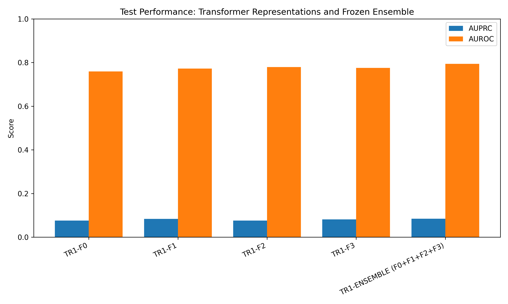
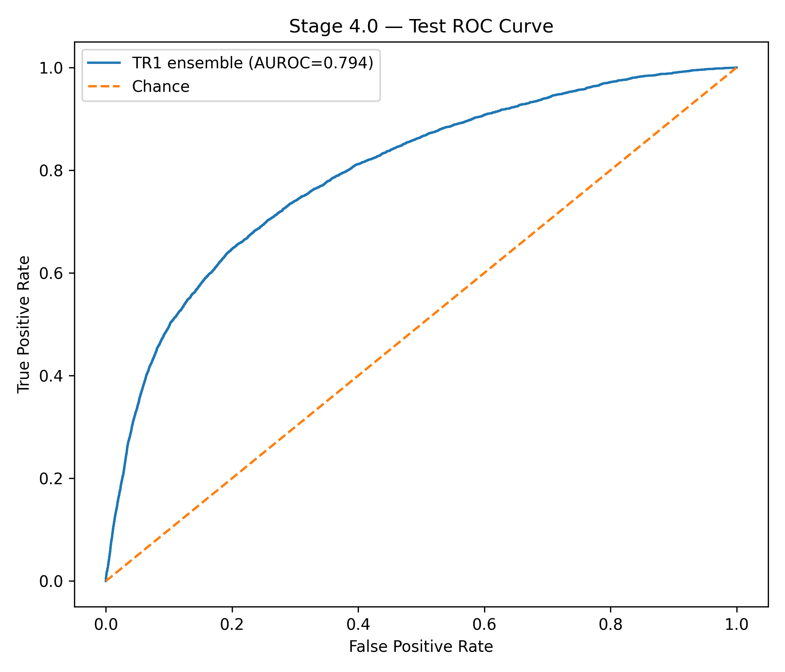
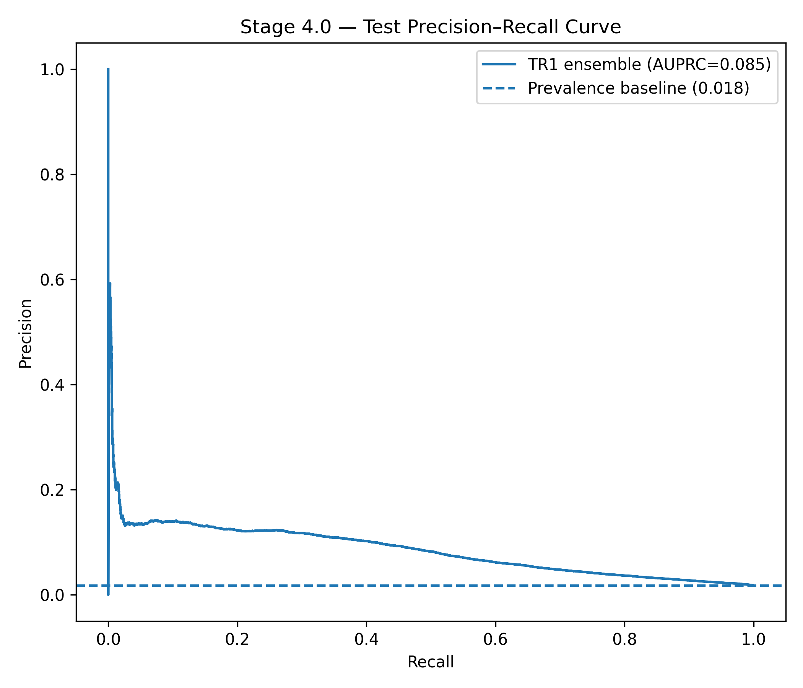
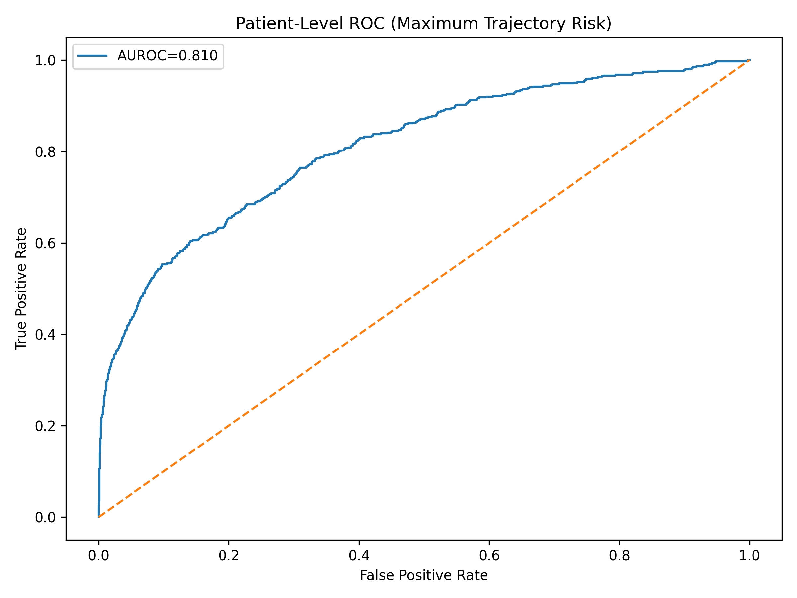
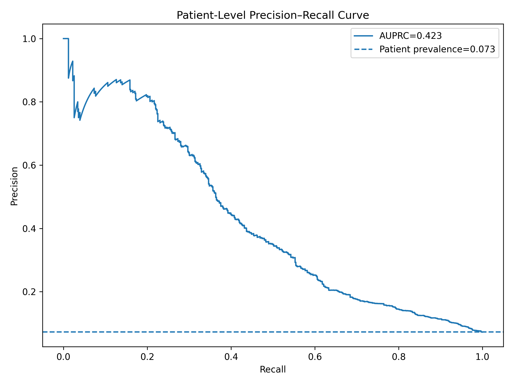
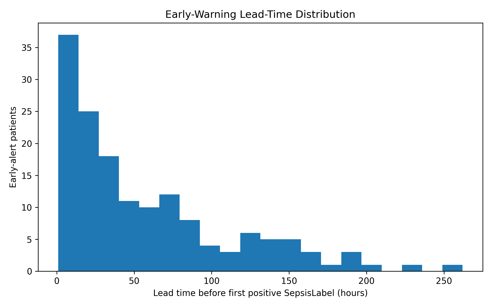

# SepsisScope

### A Systematic Framework for Analyzing Temporal Deep Learning Predictions in Sepsis

<p align="center">
  <b>Understanding temporal prediction behavior through controlled comparisons of representations, architectures, and ensembles.</b>
</p>

<p align="center">
  
</p>

---

## Abstract

**SepsisScope** is a research framework for systematically studying temporal machine learning predictions on longitudinal clinical data from the PhysioNet/CinC Challenge 2019 dataset.

The project is motivated by a simple observation: predictive performance alone does not fully describe how a temporal model behaves. Different architectures can produce substantially different prediction trajectories even when their aggregate metrics are similar. Likewise, temporal feature engineering may benefit one architecture while providing little benefit to another.

Rather than treating sepsis prediction purely as a benchmark problem, SepsisScope investigates the **nature, stability, timing, and complementarity of model predictions** under a controlled experimental protocol. The study compares GRU, LSTM, causal Transformer, and tree-based approaches across progressively richer causal feature representations, followed by systematic ensemble analysis and patient-level evaluation.

The framework is a research prototype for understanding temporal prediction behavior. It is **not a clinically validated diagnostic or decision-support system**.

---

## Research Questions

**RQ1 — Architecture.** How do GRU, LSTM, and causal Transformer architectures behave when trained on the same longitudinal clinical representation?

**RQ2 — Representation.** How does progressively adding causal temporal information affect different model families?

**RQ3 — Architecture–Representation Interaction.** Are engineered temporal representations consistently beneficial, or does their effect depend on the architecture?

**RQ4 — Prediction Complementarity.** Do different architectures and feature representations produce complementary prediction signals?

**RQ5 — Ensemble Behavior.** Can controlled ensembles improve prediction behavior compared with individual models?

**RQ6 — Patient-Level Behavior.** How do timestep-level predictions translate into patient-level outcomes and alert patterns?

**RQ7 — Temporal Behavior.** What does the timing and distribution of model alerts reveal about temporal prediction behavior?

---

## Dataset

The experiments use the **PhysioNet/CinC Challenge 2019** dataset.

| Property | Value |
|---|---:|
| Patients | 40,336 |
| Hourly observations | 1,552,210 |
| Original clinical variables | 40 |
| Sepsis patients | 2,932 |
| Non-sepsis patients | 37,404 |
| Patient-level sepsis prevalence | ~7.27% |

A key distinction in the analysis is between **patient-level prevalence** and **timestep-level prevalence**. The timestep-level positive prevalence is approximately 1.8%, creating substantial class imbalance for hourly prediction.

The raw dataset is **not included in this repository**. Obtain it from PhysioNet and place it locally according to the structure described below.

---

## Experimental Protocol

The project uses a fixed patient-level stratified split.

```text
                         PhysioNet
                            │
                            ▼
                 Patient-level stratification
                            │
              ┌─────────────┴─────────────┐
              │                           │
         Development                    Test
          32,268                       8,068
              │
        ┌─────┴─────┐
        │           │
      Train       Validation
     27,427         4,841
```

The main workflow is:

```text
Dataset
   │
   ▼
Patient-level split
   │
   ▼
Causal preprocessing
   │
   ▼
Feature hierarchy
   │
   ├── F0
   ├── F1
   ├── F2
   └── F3
   │
   ▼
Architecture families
   │
   ├── GRU
   ├── LSTM
   ├── Causal Transformer
   └── Tree-based references
   │
   ▼
Controlled model selection
   │
   ▼
Feature / architecture complementarity
   │
   ▼
Ensemble analysis
   │
   ▼
Frozen final evaluation
   │
   ▼
Timestep + patient-level analysis
```

---

## Feature Representations

A central component of SepsisScope is a progressive feature hierarchy.

### F0 — Raw + Missingness

- 40 original clinical variables
- 40 missingness indicators
- **80 features total**

### F1 — Causal Temporal Deltas

F1 extends F0 with temporal differences for selected dynamic variables over:

- 1 hour
- 3 hours
- 6 hours

### F2 — Causal Rolling Statistics

F2 adds trailing 3-hour and 6-hour:

- mean
- standard deviation
- minimum
- maximum

### F3 — Clinical Ratios and Scores

F3 adds selected clinically motivated variables, including:

- Shock Index
- BUN/Creatinine ratio
- O2Sat/FiO2
- SIRS-related features
- MEWS-related features

All temporal transformations are designed to avoid using future observations.

```text
F0
 │
 ├── Raw measurements
 └── Missingness indicators
       │
       ▼
F1
 │
 └── Causal temporal deltas
       │
       ▼
F2
 │
 └── Causal rolling statistics
       │
       ▼
F3
 │
 └── Clinical ratios and scores
```

---

## Models

### GRU

Multiple GRU configurations were evaluated by varying hidden dimension, recurrent depth, dropout, and learning rate.

Selected configuration:

```text
Hidden dimension : 256
Layers           : 2
Dropout          : 0.2
```

### LSTM

A comparable LSTM family was evaluated under the same controlled framework.

Selected configuration:

```text
Hidden dimension : 128
Layers           : 2
Dropout          : 0.2
```

### Causal Transformer

The Transformer uses strict causal self-attention. An upper-triangular attention mask prevents a prediction at time `t` from attending to observations after `t`.

Selected configuration:

```text
Model dimension   : 64
Attention heads   : 4
Transformer layers: 2
FFN dimension     : 128
Dropout            : 0.1
```

### Tree-Based References

XGBoost and LightGBM were investigated as classical machine-learning reference models.

---

## Evaluation

Because of severe timestep-level class imbalance, **AUPRC is the primary selection metric**.

Additional metrics include:

- AUROC
- AUPRC
- Precision
- Sensitivity / Recall
- Specificity
- F1
- Accuracy
- Patient-level metrics
- Calibration
- Threshold sensitivity
- Alert distributions
- Prediction timing

Both **timestep-level** and **patient-level** evaluations are reported.

---

## Architecture-Family Results

The principal F0 family experiments produced:

| Model family | Selected configuration | Validation AUPRC |
|---|---|---:|
| GRU | GRU-5 | 0.08252 |
| LSTM | LSTM-4 | 0.07629 |
| Causal Transformer | TR-1 | 0.08680 |

Corresponding test AUPRC values were approximately:

| Model | Test AUPRC |
|---|---:|
| GRU-5 | 0.08307 |
| LSTM-4 | 0.07951 |
| TR-1 | 0.08187 |

These results motivate the subsequent complementarity analysis rather than treating the best individual architecture as the end point.

---

## Feature Ablation

The selected GRU, LSTM, and Transformer configurations were evaluated across F0–F3.

The experiments indicate that the value of engineered temporal information is **architecture-dependent**. F3 was competitive across architectures, while F0 remained strong and in several cases outperformed engineered representations.

This supports the central research question: feature engineering does not necessarily provide a universal improvement independent of model architecture.

---

## Ensemble and Complementarity Analysis

SepsisScope evaluates combinations of models using validation predictions.

The analysis considers:

- individual models,
- homogeneous architecture ensembles,
- heterogeneous architecture ensembles,
- feature-combination ensembles,
- combinations across F0–F3.

The best validation configuration among the evaluated candidates was the Transformer using all four feature representations.

The final frozen ensemble is based on the selected Transformer configuration across F0–F3.

---

## Final Test Evaluation

The frozen ensemble produced the following timestep-level results:

| Metric | Result |
|---|---:|
| AUROC | **0.7939** |
| AUPRC | **0.08467** |
| Sensitivity | **27.07%** |
| Specificity | **96.45%** |
| Precision | **12.25%** |
| F1 | **0.1687** |

### Timestep confusion matrix

| | Predicted Negative | Predicted Positive |
|---|---:|---:|
| Actual Negative | 295,520 | 10,867 |
| Actual Positive | 4,088 | 1,517 |

---

## Patient-Level Evaluation

| Metric | Result |
|---|---:|
| Patients | 8,068 |
| Sepsis-positive | 586 |
| AUROC | **0.8104** |
| Sensitivity | **34.64%** |
| Specificity | **97.73%** |
| Precision | **54.42%** |
| F1 | **0.4234** |

Reporting both levels is important because a temporal model can behave differently when evaluated per hour versus per patient.

---

## Prediction Timing

The project analyzes the temporal position of the first positive alert relative to the first positive Challenge label.

| Statistic | Lead time |
|---|---:|
| Mean | 58.02 h |
| Median | 37 h |
| P25 | 15.25 h |
| P75 | 85.75 h |
| Minimum | 1 h |
| Maximum | 262 h |

These are **label-relative measurements** and should not be interpreted as independently validated clinical warning times.

---

## Alert and Calibration Analysis

The repository contains analyses of:

- alert categories,
- alert timing,
- lead-time distribution,
- calibration reliability,
- threshold sensitivity,
- timestep confusion,
- patient-level confusion,
- ROC curves,
- precision-recall curves,
- and model comparison.

Relevant figures are stored in `figures/`.

---

## Selected Figures

### Model comparison


### ROC curve



### Precision-recall curve



### Patient-level ROC



### Patient-level precision-recall



### Lead-time distribution



---

## Explainability and Future Analysis

The current framework establishes the prediction and ensemble analyses required for a deeper interpretability study.

Planned extensions include:

- SHAP-based feature attribution where appropriate,
- temporal attribution,
- feature-level contribution analysis,
- prediction stability across time,
- robustness across random seeds,
- false-alert trajectory analysis,
- representation-level interpretability,
- and external validation.

SHAP is therefore treated as an **interpretability extension**, not as a completed component of the current core experimental claims.

---

## Streamlit Demonstration

A Streamlit prototype is included for interactively examining model predictions on an individual patient trajectory.

Run:

```bash
streamlit run streamlit_app/app.py
```

The application is a research demonstration only and is **not a clinical decision-support system**.

---

## Repository Structure

```text
SepsisScope/
│
├── src/
│   ├── preprocessing
│   ├── model training
│   ├── evaluation
│   └── analysis
│
├── experiments/
│   ├── architecture comparison
│   ├── feature ablation
│   └── ensemble analysis
│
├── figures/
│   ├── final_model_comparison.png
│   ├── final_roc_curve.png
│   ├── final_precision_recall_curve.png
│   ├── final_patient_roc_curve.png
│   ├── final_patient_precision_recall_curve.png
│   ├── final_patient_confusion_matrix.png
│   ├── final_timestep_confusion_matrix.png
│   ├── final_calibration_reliability.png
│   ├── final_threshold_analysis.png
│   └── ...
│
├── reports/
│   └── final_evaluation/
│
├── results/
│   └── aggregate experiment results
│
├── streamlit_app/
│
├── paper/
│   └── manuscript
│
├── requirements.txt
├── .gitignore
└── README.md
```

Large raw datasets, processed arrays, patient-level intermediate outputs, and model checkpoints are intentionally excluded from version control.

---

## Reproducibility

### 1. Obtain the dataset

Download the PhysioNet/CinC Challenge 2019 dataset from PhysioNet.

### 2. Arrange the data

```text
data/
└── training/
    ├── training_setA/
    └── training_setB/
```

### 3. Install dependencies

```bash
pip install -r requirements.txt
```

### 4. Run preprocessing

The preprocessing pipeline performs:

- missing-value handling,
- missingness indicator construction,
- causal forward filling,
- training-only median imputation,
- temporal feature generation,
- representation construction.

### 5. Run experiments

Scripts under `src/` and `experiments/` contain the experiments for:

- dataset auditing,
- preprocessing,
- architecture comparison,
- feature ablation,
- complementarity analysis,
- ensemble selection,
- final evaluation.

Exact configurations and experimental results are documented in the accompanying manuscript and reports.

---

## Limitations

### Benchmark dependence

The experiments are based on a single publicly available dataset. External clinical validation has not been performed.

### Label-relative timing

Prediction timing is measured relative to the Challenge sepsis label and should not be interpreted as independently verified clinical onset prediction.

### Class imbalance

The timestep-level positive prevalence is approximately 1.8%, making precision-recall behavior and threshold selection particularly important.

### Exploratory development

Some experiments were conducted during exploratory development. The accompanying manuscript documents the experimental stages and their limitations.

### Computational constraints

Practical computational constraints influenced the number of epochs and configurations explored in some ablation stages.

### Clinical interpretation

The model outputs and derived features are intended for research analysis and do not establish clinical efficacy or utility.

---

## Research Status

**Status: Research prototype / manuscript in preparation**

The project is being developed as a systematic study of temporal prediction behavior rather than as a production clinical system.

---

## Citation

```bibtex
@article{more2026sepsisscope,
  title   = {SepsisScope: A Systematic Framework for Analyzing Temporal Deep Learning Predictions in Sepsis},
  author  = {More, Shardul},
  year    = {2026},
  note    = {Research manuscript in preparation}
}
```

The citation will be updated when the work is formally submitted or published.

---

## Acknowledgements

This project uses data from the **PhysioNet/CinC Challenge 2019**.

We acknowledge the organizers, contributors, and researchers who made the dataset available for scientific research.

---

## Disclaimer

SepsisScope is an academic research project.

It has **not been clinically validated** and must not be used to diagnose sepsis, guide treatment, or replace professional medical judgment.

---

<p align="center">
  <i>SepsisScope — studying not only whether a model predicts, but how its predictions behave.</i>
</p>
